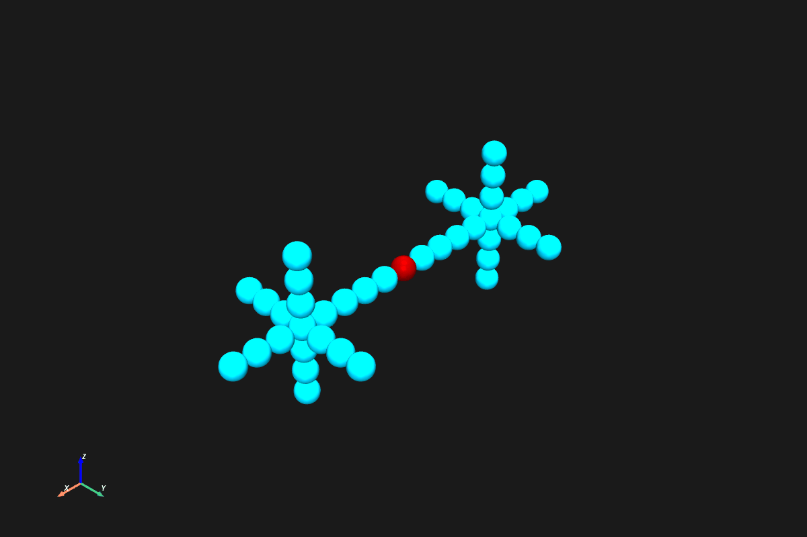

# Damage-Responsive Reconfiguration
> **Project Type:** Research



## About • Goal • Vision
Implementation of a Unit Dual Quaternion Directed Graph (UDQDG) framework for modular spacecraft reconfiguration. The system models modular structures as spherical modules connected by pure translation transformations, enabling damage-responsive reconfiguration through pivot operations.

**Goal:** Develop algorithms to restore connectivity in modular systems after damage events through minimal pivot sequences.

**Vision:** Provide a mathematical foundation and computational framework for autonomous reconfiguration of modular spacecraft and robotic systems.

## Getting Started

### Requirements
Dependencies and environment:
```bash
python >= 3.12
numpy
pyvista
```

### Installation
```bash
uv pip install numpy pyvista
```

### How to Run
Basic usage:
```python
from src.udqdg_system import UDQDGSystem
from src.configurations import create_star_configuration

# Create a system
system = create_star_configuration(size=3)

# Perform a corner pivot
system.corner_pivot('PX3', 'PX2', 'POS_Z')
```

Interactive visualization:
```bash
uv run examples/visualize_pivots.py star
uv run examples/visualize_pivots.py corner
uv run examples/visualize_pivots.py spiral
```


## Repository Structure
Key directories explained:

```
├── docs/               # Problem formulation and theoretical framework
│   └── problem_statement.md
├── src/                # Core Python package
│   ├── dual_quaternion.py    # Unit dual quaternion mathematics
│   ├── udqdg_system.py       # UDQDG system and pivot operations
│   ├── configurations.py     # Pre-defined and random test configurations
│   ├── monte_carlo.py        # Monte Carlo simulation framework
│   └── visualizer.py         # PyVista 3D visualization
├── examples/           # Demonstration scripts
│   └── visualize_pivots.py   # Interactive demos and GIF export
├── run_monte_carlo_sweep.py  # CLI for running Monte Carlo simulations
├── gifs/               # Exported animation files
└── monte_carlo_results/      # Simulation output data and graphs
```

## Core Components

### Dual Quaternion Mathematics
The `dual_quaternion.py` module implements unit dual quaternions for pure translation transformations:
- Translation-only transformations on 3D cubic lattice
- Six lattice directions: POS/NEG X, Y, Z
- Dual quaternion composition and inverse operations

### UDQDG System
The `udqdg_system.py` module provides:
- Spherical module representation with position and activity state
- Edge connections with dual quaternion gains
- Corner pivot: rotate module around neighbor's corner (90 degrees, orthogonal direction)
- Lateral pivot: roll module from one neighbor to an adjacent neighbor
- Pivotability validation: module and all neighbors must be active
- Port exclusivity: each module face supports at most one connection

### Configuration Library
The `configurations.py` module includes pre-built and random test configurations:

**Predefined Structures:**
- Star: central module with 6 radial arms
- Tree: hierarchical branching structure
- Line: straight sequence along specified axis
- Cross: 3D plus shape with XY plane and Z extension
- Helix: spiral staircase configuration
- L-shape: simple L configuration for testing corner pivots
- Grid: 3D cubic grid configuration
- Lattice Plane: 2D flat grid in XY plane
- Ring: loop/square ring structure
- Snake: winding path through 3D space
- T-shape: T-shaped structure with central junction
- Dual Star Bridge: two stars connected by a bridge

**Random Generators (for Monte Carlo):**
- `create_random_configuration`: random walk growth with configurable connectivity (fully-connected or chain-like)
- `create_random_tree_configuration`: random spanning tree (no cycles, n-1 edges)

### Interactive Visualizer
The `visualizer.py` module provides PyVista-based 3D visualization:
- Real-time rendering of modular systems with spherical modules
- Smooth arc interpolation for pivot animations
- Corner and lateral pivot animation with customizable frame counts
- Parallel pivot execution for synchronized multi-module movements
- Camera rotation during animations for better perspective
- Color-coded module states: active (cyan), inactive (red), pivoting (orange)

### Demonstration and Export
The `examples/visualize_pivots.py` script offers:

**Interactive Demos:**
- `corner`: Corner pivot demonstration on L-shaped configuration
- `lateral`: Lateral pivot with module rolling along a line
- `parallel`: Synchronized multi-module pivots on star configuration
- `spiral`: Complex sequence combining corner and lateral pivots
- `general`: Comprehensive demonstration of all pivot types and directions

**Interactive Configurations:**
- `star`, `tree`, `line`, `cross`, `helix`, `l_shape`, `grid`, `ring`, `snake`, `t_shape`: explore predefined configurations

**Creating Custom Animations:**
```python
from src.visualizer import UDQDGVisualizer
from src.configurations import create_star_configuration

# Create a system
system = create_star_configuration(size=3)
viz = UDQDGVisualizer(system)

# Define a pivot sequence
sequence = [
    # Corner pivot: ('corner', pivot_module, axis_module, new_direction)
    ('corner', 'PX3', 'PX2', 'POS_Z'),  # Rotate PX3 around PX2 upward
    ('corner', 'PX3', 'PX2', 'POS_Y'),  # Rotate PX3 around PX2 forward

    # Lateral pivot: ('lateral', pivot_module, old_neighbor, new_neighbor)
    ('lateral', 'PX3', 'PX2', 'PX1'),   # Roll PX3 from PX2 to PX1

    # Parallel pivots: ('parallel', [list of pivot operations])
    ('parallel', [
        ('corner', 'PY3', 'PY2', 'POS_Z'),
        ('corner', 'NX3', 'NX2', 'POS_Z'),
    ]),
]

# Animate the sequence
viz.show_window()
viz.animate_pivot_sequence(sequence, n_frames=12, pause_between=0.25)
viz.plotter.close()
```

**Available Directions:**
- `POS_X`, `NEG_X`: positive/negative X axis
- `POS_Y`, `NEG_Y`: positive/negative Y axis
- `POS_Z`, `NEG_Z`: positive/negative Z axis

**Animation Parameters:**
- `n_frames`: Number of interpolation frames per pivot (default: 12, higher = smoother but slower)
- `pause_between`: Pause duration in seconds between operations (default: 0.25)

**Creating Custom Configurations:**
```python
from src.udqdg_system import UDQDGSystem
import numpy as np

system = UDQDGSystem()

# Add modules at specific positions
system.add_module("M0", np.array([0, 0, 0]))
system.add_module("M1", np.array([1, 0, 0]))
system.add_module("M2", np.array([2, 0, 0]))

# Connect modules (only unit lattice steps allowed)
system.connect_modules("M0", "M1")
system.connect_modules("M1", "M2")

# Visualize
viz = UDQDGVisualizer(system)
viz.show()
```

**GIF Export:**

Using built-in demos:
```bash
uv run examples/visualize_pivots.py export corner [output_path]
uv run examples/visualize_pivots.py export spiral gifs/my_animation.gif
```

Available demo exports: `corner`, `lateral`, `spiral`, `parallel`, `general`

**Creating Custom GIF Exports:**
```python
from src.visualizer import UDQDGVisualizer
from src.configurations import create_line_configuration

# Create your system and sequence
system = create_line_configuration(length=5, axis='X')
viz = UDQDGVisualizer(system)

# Setup for export
viz.setup_scene()
viz.render_system()

# Open GIF writer
viz.plotter.open_gif('output/my_animation.gif', fps=30)

# Add initial pause frames (0.5 sec = 15 frames at 30fps)
for _ in range(15):
    viz.plotter.write_frame()

# Define and animate your sequence
sequence = [
    ('corner', 'M4', 'M3', 'POS_Z'),
    ('corner', 'M4', 'M3', 'POS_Y'),
]

# Animate frame by frame (helper functions available in examples/visualize_pivots.py)
for operation in sequence:
    # Use _export_corner_pivot or _export_lateral_pivot helpers
    # Or implement custom frame-by-frame animation
    pass

# Add final pause frames
for _ in range(15):
    viz.plotter.write_frame()

# Save the GIF
viz.plotter.close()
```

**GIF Export Features:**
- 30 FPS smooth playback by default
- Diagonal camera rotation during animation for better viewing angles
- Configurable pause durations between operations
- Initial and final configuration pauses for clarity

## Monte Carlo Simulation

The framework includes a Monte Carlo simulation system for evaluating damage response algorithms across varying structure sizes and fault conditions.

### Running Simulations

```bash
# Basic sweep: n=5-50 modules, 1 fault, 100 trials each
uv run python run_monte_carlo_sweep.py

# Custom range with more trials
uv run python run_monte_carlo_sweep.py --n-min 10 --n-max 100 --trials 500

# Dynamic faults: f = floor(n/10)
uv run python run_monte_carlo_sweep.py --dynamic-faults

# Tree-based configurations
uv run python run_monte_carlo_sweep.py --tree
```

### Random Configuration Generation

The simulation supports two methods for generating random test configurations:

#### Fully-Connected (Default)
```bash
uv run python run_monte_carlo_sweep.py  # default behavior
```

**Algorithm:**
1. Start with a single module at the origin
2. Maintain a frontier of unoccupied adjacent positions
3. Randomly select from frontier and add new modules
4. Connect new modules to **all** adjacent existing modules

**Characteristics:**
- Creates dense, highly-connected structures
- Multiple redundant paths between modules
- More resilient to single faults (fewer cause disconnection)
- Fewer "meaningful" trials where faults actually disconnect the structure

#### Tree-Based (`--tree`)
```bash
uv run python run_monte_carlo_sweep.py --tree
```

**Algorithm:**
1. Start with a single module at the origin
2. Maintain a frontier of (position, parent) pairs
3. Randomly select from frontier and add new modules
4. Connect each new module to **exactly one** parent (tree property)

**Characteristics:**
- Creates spanning tree structures with no cycles
- Exactly n-1 edges for n modules
- Every fault causes disconnection (100% meaningful trials)
- Lower restoration error due to simpler topology

#### Chain-Like (`--chain-like`)
```bash
uv run python run_monte_carlo_sweep.py --chain-like
```

**Algorithm:**
- Same as fully-connected but connects to only **one** random adjacent module
- Creates more linear, chain-like structures
- Requires more moves to restore after damage

### Fault Injection Modes

#### Fixed Faults (Default)
```bash
uv run python run_monte_carlo_sweep.py --faults 3  # Always inject 3 faults
```
Injects a constant number of faults regardless of structure size.

#### Dynamic Faults (`--dynamic-faults`)
```bash
uv run python run_monte_carlo_sweep.py --dynamic-faults
```
Fault count scales with structure size: **f = floor(n/10)**

| Modules (n) | Faults (f) |
|-------------|------------|
| 10-19 | 1 |
| 20-29 | 2 |
| 30-39 | 3 |
| ... | ... |
| 100 | 10 |

This mode tests how the algorithm handles proportionally increasing damage.

### Output Files

Results are saved to timestamped directories:
```
monte_carlo_results/
└── 20260119_113254/
    ├── config.json              # Simulation parameters
    ├── sweep_summary.csv        # Aggregated results per (n, f)
    ├── trials.csv               # Individual trial data
    ├── graphs_combined.png      # All 3 metrics in one figure
    ├── graph_reconnection_rate.png
    ├── graph_total_difference.png
    └── graph_missing_portions.png
```

### Metrics

- **Reconnection Rate**: Percentage of meaningful trials where the structure was successfully reconnected
- **Total Difference**: Symmetric difference between original and final positions, normalized by n
- **Missing Portions**: Positions that existed originally but are missing after restoration, normalized by n

### CLI Options Reference

| Option | Description |
|--------|-------------|
| `--n-min N` | Minimum modules (default: 5) |
| `--n-max N` | Maximum modules (default: 50) |
| `--faults F` | Fixed fault count (default: 1) |
| `--trials T` | Trials per configuration (default: 100) |
| `--seed S` | Random seed (default: 42) |
| `--output-dir DIR` | Output directory |
| `--no-graphs` | Skip graph generation |
| `--mode-2d` | Use 2D mode (XY plane only) |
| `--fully-connected` | Connect to all neighbors (default) |
| `--chain-like` | Connect to one neighbor only |
| `--tree` | Use tree-based generation |
| `--dynamic-faults` | Use f=floor(n/10) |

## Problem Formulation
The mathematical framework is detailed in `docs/problem_statement.md` covering:
- Unit Dual Quaternion Directed Graph representation
- Pure translation-only transformations on cubic lattice
- Corner and lateral pivot operation definitions
- Port exclusivity and pivotability constraints
- Connectivity recovery objective after damage events

## Open Issues
Known limitations and planned work:
- Lateral pivot edge connections require validation after pivot
- Path planning algorithms for optimal pivot sequences not yet implemented
- Position restoration (Phase 2) algorithm optimization ongoing

## Extending to Cubic Modules

The current implementation uses spherical modules, which simplifies visualization since spheres have rotational symmetry. The underlying UDQDG system works identically for cubic modules - only the animation visualization needs modification to show proper rotation.

### Animation Changes for Cubic Modules

**Corner Pivot Animation**
- Current: Position interpolation along 90-degree arc around corner
- Cubic: Add 270-degree rotation as cube flops around corner edge
- Rotation axis: perpendicular to both old and new attachment directions
- Implementation: Simultaneously interpolate position (arc) and orientation (270° rotation)
- Note: Arc motion is essential - cube flops over the edge, not translating linearly

**Lateral Pivot Animation**
- Current: Position interpolation along two connected arcs (rolling between neighbors)
- Cubic: Add 90-degree rotation as cube flops over shared corner/edge
- Rotation axis: parallel to the edge being rolled over
- Implementation: Simultaneously interpolate position (arc path) and orientation (90° rotation)
- Note: Motion follows arc as cube flops from one neighbor face to adjacent neighbor face

**Required Visualization Changes:**
- Replace sphere meshes with cube meshes in `visualizer.py`
- Add orientation quaternion to module state
- Apply rotation matrix to cube at each animation frame
- Use SLERP for smooth orientation interpolation

Additionally, cubic modules may need different constraints due to collisions from corner to corner

## License & Attribution
Research project for modular spacecraft reconfiguration.
